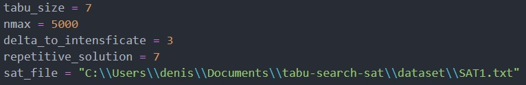
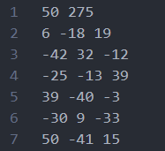

# Tabu-Search-Sat

## Tutorial

### Defining the 3-SAT problem instance path
Rename the configuration.example.py file to configuration.py and set its respective parameters, as not shown below:



The instance of the problem must follow the same structure as shown in the image below, where in the first line we have the amount of literals and clauses and the other lines represent the problem:



### Run Tabu Search Algorithm
If you know the global optimal solution, you can pass the value to the algorithm in the terminal:
```
python3 main.py <optimal_value>
```

If you don't know, just run the algorithm:
```
python3 main.py
```

May the force be with you...